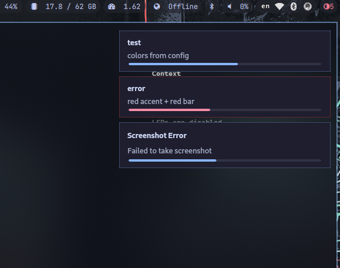

# symm

A wlr-layer-shell notification daemon (DBus org.freedesktop.Notifications).

> [!NOTE]
> Made on hyprland




```sh
git clone git@github.com:lukasfischertbz/symm.git
cd symm
make install clear run
```

Test

```sh
notify-send -u low "low" "Message"
notify-send -u normal "normal" "Message"
notify-send -u critical "critical" "Message"

notify-send "" "1\n2"
notify-send -h string:persistence:true "Click me"
```

---

## Build

Requires Qt6 (Core Gui Widgets DBus) and Layer Shell Qt.

```sh
make build
```

---

## Install

```sh
make
```

## Uninstall

```sh
make uninstall
```

---

## Run

```sh
symm & disown
```

Starts the DBus notification server and displays floating notifications.

---

## Config

Config is loaded from `~/.config/symm/config.conf` (respects `$XDG_CONFIG_HOME`).
If the file is missing, defaults are used.

> [!NOTE]
> Configs are loaded for every notification

Copy preset

```sh
mkdir -p ~/.config/symm && cp config.conf ~/.config/symm/config.conf
```

[Example](config.conf)

```ini
[general]
width = 360
margin = 20
radius = 12
font_family = Cantarell
font_size = 10.5
timeout_low = 10000
timeout_normal = 5000
timeout_critical = 15000
timer_default = 10000

[colors]
background = #1e1e2e
foreground = #cdd6f4
dim_foreground = #a6adc8

[urgent_low]
bar = #6c7086
accent = #6c7086

[urgent_normal]
# ...
```

Section `urgent_error` applies to unclassified notifications; `urgent_normal`
to normal; `urgent_critical` to critical. Colors accept any QColor string.

---

## Features

- [x] Timeout visualizer
- [x] Actions
- [x] Transparency
- [ ] Presets
- [ ] History
- [ ] Details (click a truncated notification to expand it)
- [ ] Icons
- [ ] App-side blur (kitty-style frosted background, any compositor)
- [ ] Use active monitor (Hyprland; on send only)
- [ ] Texture
